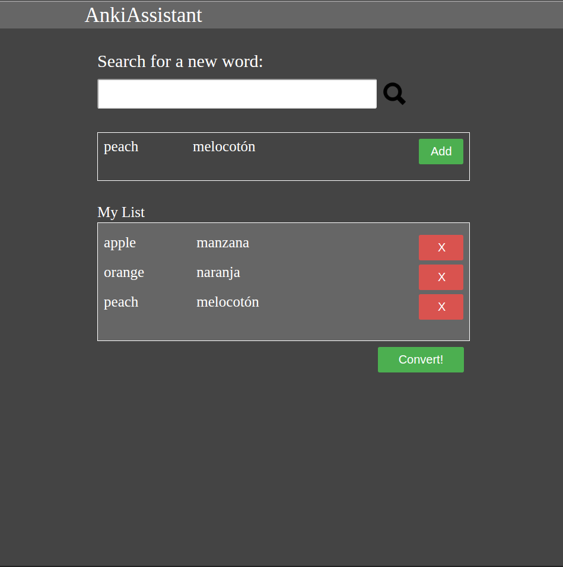

AnkiAssistant

AnkiAssistant allows language learners to quickly and easily create customized flash card decks to be used with Anki flash card software.

AnkiAssistant utilizes the Globse dictionary API to allow users for translations of word they'd like to learn and create vocabulary lists that can be readily converted into Anki flash card decks.

This app emolys HTML/CSS/JavaScript/jQuery technologies

